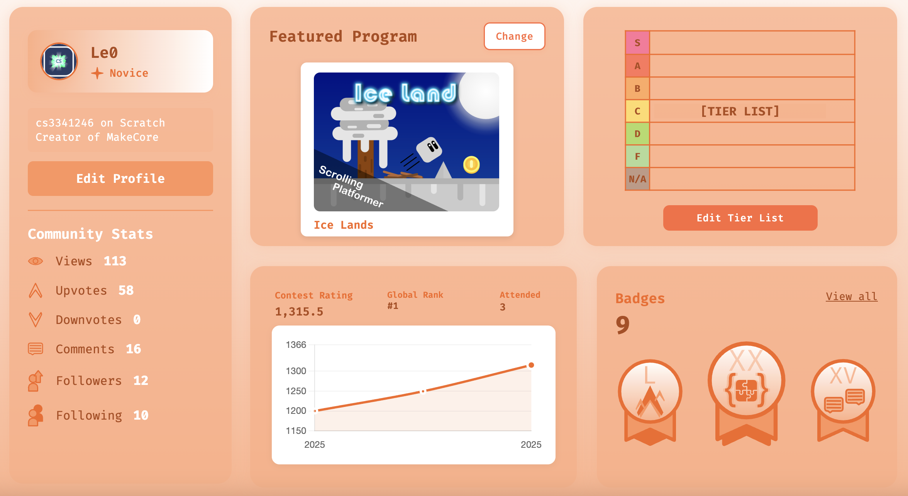
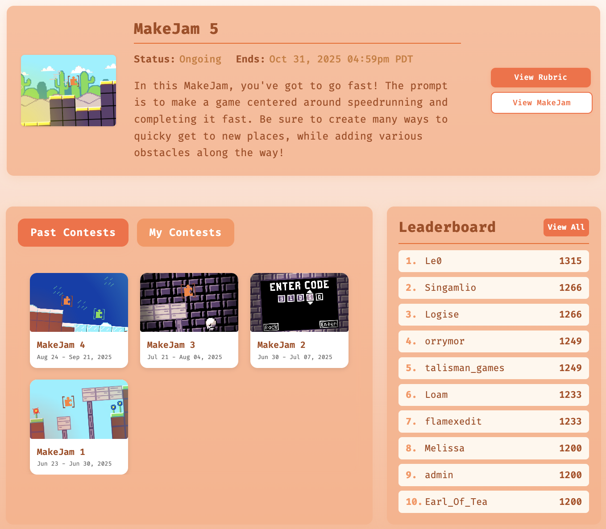
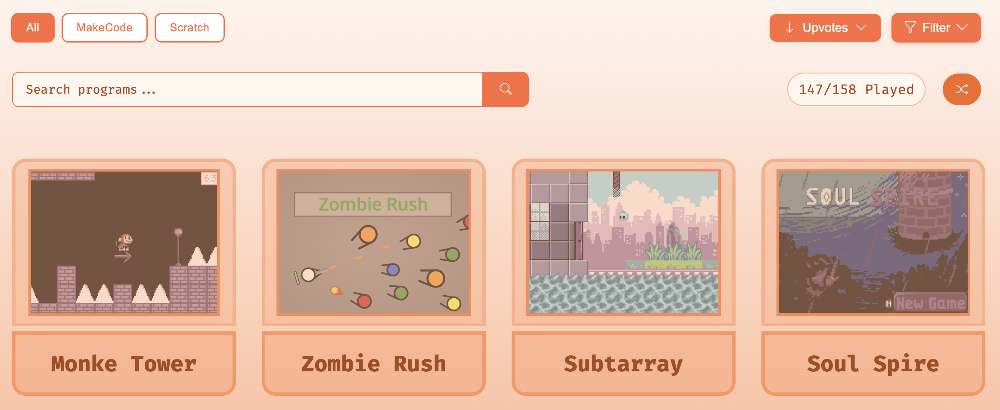
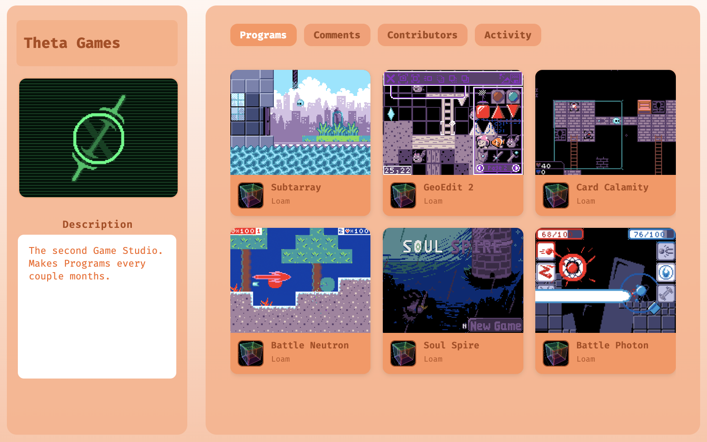

<table align="center">
  <tr>
    <td>
      
    </td>
    <td>
      <h3 style="font-size: 55px;">MakeCore</h1>
    </td>
  </tr>
</table>

  <strong>Start:</strong> March 28, 2025 | <strong>Release:</strong> June 14, 2025 | <strong>End:</strong> October 25, 2025 
  <strong>4+ months spent | 15,000+ lines of code</strong>

> “One commit a day keeps unemployment away.” – Leo Lu, 2025

## About
MakeCore is an online platform designed for sharing, reviewing, and discussing MakeCode and Scratch programs. Users can create programs, join studios, participate in game contests (MakeJams), and interact with the community.

**Live Project:** [https://makecore.org](https://makecore.org)

## How It's Made
**Tech used:** HTML, CSS, JavaScript, Flask (Python), PostgreSQL, Supabase, Render, MailGun

MakeCore was built with a focus on community collaboration and interactive features:
- Programs with comments, upvotes/downvotes, and version tracking  
- Studios with role-based member system and activity tracking  
- MakeJam contests with scoring, ranking, leaderboards, and countdowns  
- Dynamic dashboard showing community stats and program highlights  
- Authentication flows including email verification and password reset  

## Lessons Learned
- Managing user sessions in Flask
- Handling image uploads to Supabase
- Designing clean and structured UI 
- Connecting frontend components to backend endpoints via JS-based API requests

## Features

### Programs
- Create, edit, delete programs  
- Display developer, last updated, version  
- Interactive features: comments, upvotes/downvotes  
- Mod permissions implemented  

### Studios
- Role-based member system: contributor, manager, creator  
- Add/remove programs to studios  
- Activity tab to track program additions/removals  
- Studio comments  

### UI
- Custom orange, green, and blue themes  
- Clean layouts, consistent design  
- Icons designed in Google Slides  

### MakeJams
- Contest creation tools  
- Submission system with scoring, ranking, finalization  
- Public leaderboards  
- Custom countdowns for last hour and last 60 seconds  

### Dashboard
- Bento box style layout  
- Community stats, featured programs  
- Graphs showing rating changes  

### Authentication
- Sign-in and registration  
- Google OAuth Implementation
- Email verification & password reset  
- Profile editing  

### Infrastructure
- Supabase for storing images  
- MailGun integration  
- Website and PostgreSQL hosted on Render  

## Screenshots

**Dashboard**

**MakeJam**

**Program Page**

**Studio Page**

